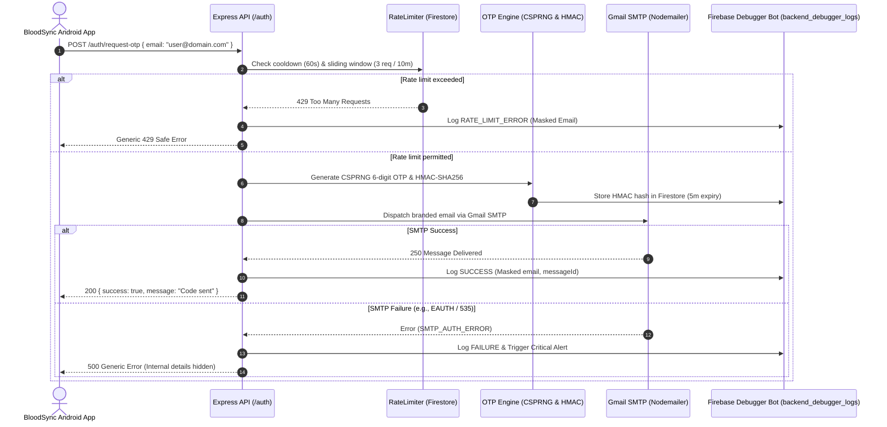

# 🩸 BloodSync OTP & Firebase Debugger Bot Backend

Production-ready backend service providing cryptographically secure OTP email verification integrated with Gmail SMTP (Nodemailer), Firebase Firestore, and an automated Firebase Debugger/Monitoring Bot.

---

## 🏗️ Architecture Overview



---

## 🔑 Gmail SMTP Setup Guide

To send emails using Gmail SMTP, **do not** use your regular Google account password. Google requires a dedicated **16-character App Password**.

### Step-by-Step Gmail App Password Generation:
1. Log in to your dedicated BloodSync Gmail account at [myaccount.google.com](https://myaccount.google.com).
2. Go to **Security** > **How you sign in to Google**.
3. Ensure **2-Step Verification** is turned **ON**.
4. In the search bar at the top of Google Account, type **App Passwords** (or visit `https://myaccount.google.com/apppasswords`).
5. Under **App name**, enter: `BloodSync Backend OTP`.
6. Click **Create**. Google will display a 16-character code (e.g., `abcd efgh ijkl mnop`).
7. Copy this string (without spaces) and paste it into your `.env` file as `SMTP_PASSWORD`.

### Port Configuration:
- **Port 465 (`SMTP_PORT=465`, `SMTP_SECURE=true`)**: Direct SSL connection (Recommended for Gmail).
- **Port 587 (`SMTP_PORT=587`, `SMTP_SECURE=false`)**: STARTTLS connection.

---

## ⚙️ Environment Variables (`.env`)

Copy `.env.example` to `.env` and fill in the values:

```bash
cp .env.example .env
```

| Variable | Description | Default / Example |
| :--- | :--- | :--- |
| `PORT` | Backend listening port | `5000` |
| `NODE_ENV` | Environment (`development` or `production`) | `development` |
| `SMTP_HOST` | Gmail SMTP host | `smtp.gmail.com` |
| `SMTP_PORT` | SMTP Port | `465` (or `587`) |
| `SMTP_SECURE` | Use SSL directly | `true` |
| `SMTP_USER` | Gmail address | `bloodsync.alerts@gmail.com` |
| `SMTP_PASSWORD` | 16-character Google App Password | `abcdefghijklmnop` |
| `EMAIL_FROM_NAME` | Sender display name | `"BloodSync Security"` |
| `FIREBASE_PROJECT_ID`| Firebase project ID | `bloodsync-3b5cf` |
| `FIREBASE_SERVICE_ACCOUNT_PATH` | Path to downloaded service account JSON | `./config/firebase-service-account.json` |
| `OTP_EXPIRY_MINUTES` | OTP time to live | `5` |
| `OTP_MAX_ATTEMPTS` | Maximum failed verification tries | `5` |
| `OTP_SALT_SECRET` | 64+ char random secret for HMAC hashing | *Random 64-char string* |
| `JWT_SECRET` | Secret key for JWT session tokens | *Random 32-char string* |
| `RATE_LIMIT_COOLDOWN_SECONDS` | Cooldown between OTP requests | `60` |
| `RATE_LIMIT_WINDOW_MINUTES` | Rate limit sliding window | `10` |
| `RATE_LIMIT_MAX_REQUESTS_PER_WINDOW` | Max requests allowed per window | `3` |
| `ENABLE_REALTIME_ALERTS` | Enable automated alerts for critical failures | `true` |
| `ALERT_WEBHOOK_URL` | Webhook for Slack/Discord alerts | Optional |

---

## 📡 API Endpoints

### 1. Request OTP
**`POST /auth/request-otp`**

#### Request:
```json
{
  "email": "donor@example.com"
}
```

#### Success Response (`200 OK`):
```json
{
  "success": true,
  "message": "Verification code sent to your email address.",
  "data": {
    "maskedEmail": "d***r@example.com",
    "expiresInMinutes": 5
  }
}
```

#### Rate Limited Response (`429 Too Many Requests`):
```json
{
  "success": false,
  "message": "Please wait 54s before requesting a new verification code.",
  "retryAfterSeconds": 54
}
```

#### Failure Response (`500 Internal Server Error`):
*(Safe generic message; exact technical error is logged to `backend_debugger_logs`)*
```json
{
  "success": false,
  "message": "Failed to deliver verification code. Please check your email and try again later."
}
```

---

### 2. Verify OTP
**`POST /auth/verify-otp`**

#### Request:
```json
{
  "email": "donor@example.com",
  "otp": "481920"
}
```

#### Success Response (`200 OK`):
```json
{
  "success": true,
  "message": "Email verified successfully.",
  "data": {
    "token": "eyJhbGciOiJIUzI1NiIsInR5cCI6...",
    "firebaseCustomToken": "eyJhbGciOiJSUzI1NiIsImtpZCI6...",
    "user": {
      "email": "donor@example.com",
      "maskedEmail": "d***r@example.com"
    }
  }
}
```

---

## 🤖 Firebase Debugger Bot & Collection Schema

Every verification attempt and failure is recorded in Firestore under `backend_debugger_logs`:

```json
{
  "timestamp": "2026-10-02T05:48:22Z",
  "requestId": "4fa92c01-71e8-46d2-969c-29a34bc1a721",
  "maskedUserEmail": "d***r@example.com",
  "requestStatus": "FAILURE",
  "otpGenStatus": "GENERATED",
  "emailSendingStatus": "FAILED",
  "errorCategory": "SMTP_AUTH_ERROR",
  "errorMessage": "Gmail SMTP Authentication Failed. Check SMTP_USER and Gmail 16-character App Password.",
  "serverEnvironment": "production",
  "metadata": {
    "clientIp": "192.168.1.xxx",
    "userAgent": "BloodSync-Android/2.6.8",
    "durationMs": 312
  }
}
```

### Standardized Error Taxonomy:
1. `OTP_GENERATION_ERROR`: CSPRNG entropy or memory fault.
2. `OTP_DATABASE_ERROR`: Firestore write/read failure for verification records.
3. `EMAIL_CONFIGURATION_ERROR`: Missing credentials, unreachable SMTP server or DNS issues.
4. `SMTP_AUTH_ERROR`: Gmail bad credentials, expired App Password, or 2FA challenge.
5. `EMAIL_SEND_ERROR`: Mailbox full, rejected recipient, or connection drop.
6. `FIREBASE_ERROR`: General Firebase Admin SDK error.
7. `RATE_LIMIT_ERROR`: Cooldown violation or spam burst.
8. `UNKNOWN_ERROR`: Unhandled runtime exceptions.

---

## 📱 Android Client Integration Example (Kotlin)

```kotlin
// Data Models
data class OtpRequest(val email: String)
data class OtpVerifyRequest(val email: String, val otp: String)
data class OtpResponse(val success: Boolean, val message: String)
data class OtpVerifyResponse(
    val success: Boolean,
    val message: String,
    val data: AuthData?
)
data class AuthData(
    val token: String,
    val firebaseCustomToken: String?
)

// Retrofit Interface
interface BloodSyncAuthApi {
    @POST("auth/request-otp")
    suspend fun requestOtp(@Body request: OtpRequest): Response<OtpResponse>

    @POST("auth/verify-otp")
    suspend fun verifyOtp(@Body request: OtpVerifyRequest): Response<OtpVerifyResponse>
}

// In your ViewModel / Repository:
suspend fun verifyAndSignIn(email: String, otp: String) {
    val response = authApi.verifyOtp(OtpVerifyRequest(email, otp))
    if (response.isSuccessful && response.body()?.success == true) {
        val customToken = response.body()?.data?.firebaseCustomToken
        if (!customToken.isNullOrBlank()) {
            // Sign in directly to Firebase Auth on Android
            FirebaseAuth.getInstance().signInWithCustomToken(customToken).await()
        }
    }
}
```
